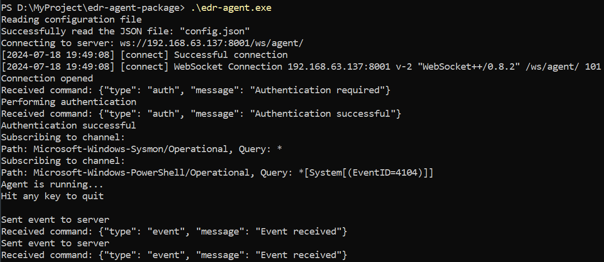

# EDR Agent


The EDR (Endpoint Detection and Response) Agent is a comprehensive (simple for now) security solution designed to be installed on client computers. Its primary function is to monitor system events and send relevant information to the EDR server for further analysis and response. Additionally, the agent is capable of receiving and executing commands from the EDR server, enabling remote incident response and management.

## Features

- **Event Monitoring and Reporting:** Monitors specified system events and reports them to the EDR server in real-time. This includes events from sources like Microsoft-Windows-Sysmon/Operational and Microsoft-Windows-PowerShell/Operational.

- **Command Execution:** Receives and executes commands from the EDR server, such as initiating a reverse shell, allowing for remote troubleshooting and incident response.

- **Configurable Event Sources:** Allows for customization of monitored event sources and queries through a simple JSON configuration, enabling targeted monitoring tailored to specific security needs.

- **Secure Communication:** Utilizes WebSocket for secure and efficient communication with the EDR server, ensuring that sensitive data is transmitted securely. (not implemented yet)

## Installation

1. **Pre-requisites:** Ensure that the target system meets the necessary requirements, including Windows OS and necessary permissions for installation and operation.

2. **Download:** Obtain the latest version of the EDR Agent from the official repository or distribution site.

3. **Configuration:** Edit the `config.json` file to specify the EDR server URI, event sources, and other settings as per your requirements.

4. **Start the Agent:** Run `edr_agent.exe` as an administrator to start the agent. The agent will begin monitoring events and communicating with the EDR server.

## Configuration

The agent's behavior can be customized through the `config.json` file. Key configuration options include:

- `uri`: The WebSocket URI of the EDR server.
- `event_processor`: Defines the sources of events to monitor.
- `command_processor`: Configuration for command execution, including reverse shell settings.

Example:

```json
{
  "uri": "ws://192.168.63.137:8000/ws/agent/",
  "event_processor": {
    "source": [
      {
        "path": "Microsoft-Windows-Sysmon/Operational",
        "query": "*"
      },
      {
        "path": "Microsoft-Windows-PowerShell/Operational",
        "query": "*[System[(EventID=4104)]]"
      }
    ]
  },
  "command_processor": {
    "reverse_shell": {
      "ip": "192.168.63.137",
      "port": 4444
    }
  }
}
```

## Usage

Once installed and configured, the EDR Agent operates autonomously, monitoring specified events and communicating with the EDR server. Interaction with the agent is primarily through the EDR server's interface for command execution and event analysis.



## Contributing

Contributions are welcome! Please feel free to submit a pull request or open an issue if you encounter any problems or have suggestions for improvements.

## License

This project is licensed under the MIT License - see the [LICENSE](LICENSE) file for details.

